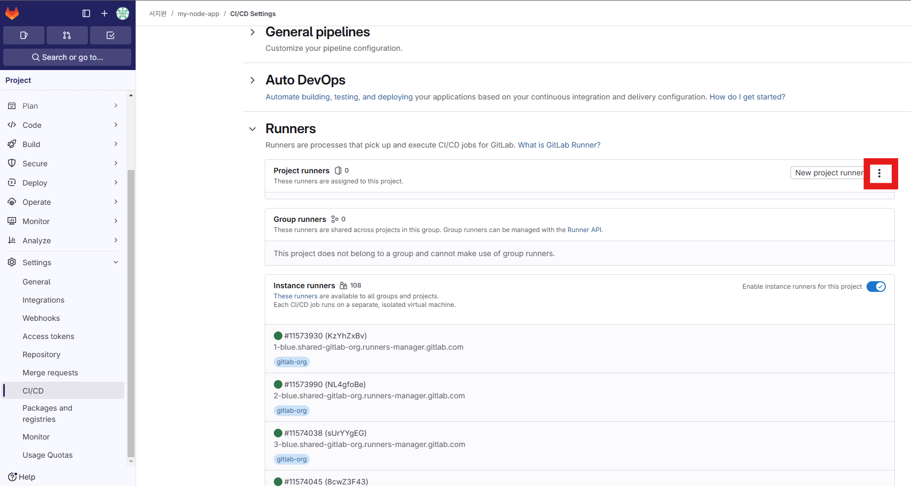

## my-node-app CI/CD 실습 (with gitlab runner)

# node.js 프로젝트 생성
```
cd my-node-app
npm init -y
npm i express 
```

# my-node-app index.js 파일 생성
```
const express = require('express');
const app = express();
const port = 3000;
app.get('/', (req, res) => res.send('Hello CI/CD!'));
app.listen(port, () => console.log(`Server running on port ${port}`));
```

# package.json start script 추가
```
"scripts": {
  "start": "node index.js"
}
```

# gitlab 저장소 생성, my-node-app push
```
cd my-node-app
git init
git remote add origin https://gitlab.com/wldhks1101/my-node-app.git
git pull origin main --allow-unrelated-histories
git add .
git commit -m "init"
git push origin main
```

# ubuntu 서버 gitlab runner 설치
```
curl -L https://packages.gitlab.com/install/repositories/runner/gitlab-runner/script.deb.sh | sudo bash
sudo apt install gitlab-runner
```

# gitlab runner 등록
```
프로젝트 > Settings > CI/CD > Runners > 점 세개
"Registration token" 복사
```

```
sudo gitlab-runner register
```

```
질문 | 입력 예시
URL | https://gitlab.com/
Token | (웹에서 복사한 값)
Description | my-node-runner
Tags | nodejs
Executor | shell
```

# .gitlab-ci.yml 작성
```
stages:
  - deploy

deploy_node:
  stage: deploy
  script:
    - echo "Deploying Node.js app..."
    - npm install
    - pm2 delete all || true
    - pm2 start index.js
  tags:
    - nodejs
```

```
PM2(Process Manager2)는 Node.js 애플리케이션을 프로덕션 환경에서 실행/관리하는 툴
Node.js 앱을 백그라운드에서 안정적으로 실행행
```

# 푸시 후 자동 배포 확인
```
git add .
git commit -m "runner test"
git push origin main
```

# 자동배포 성공
